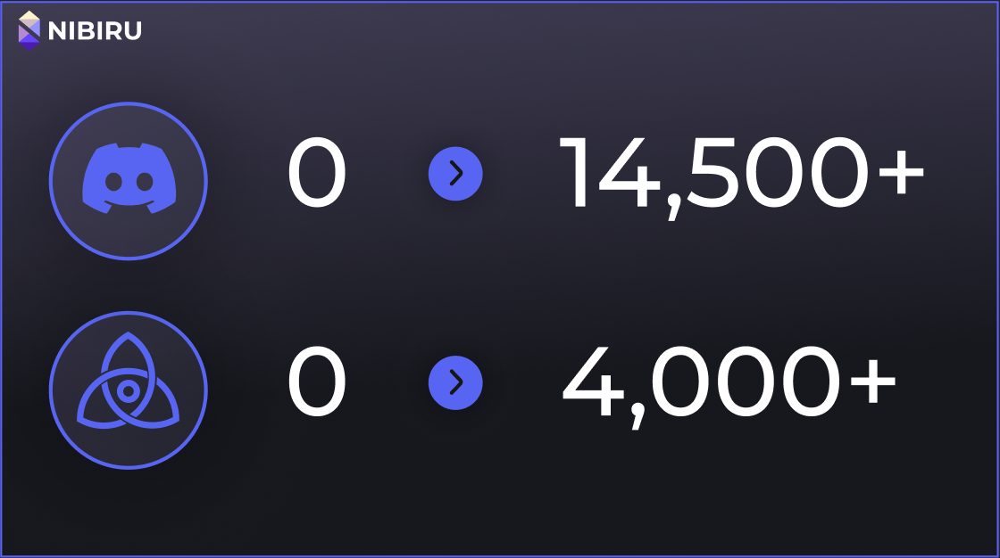
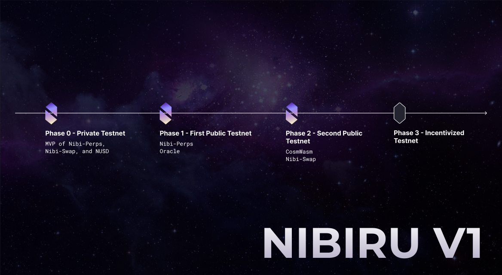

Today, we’re excited to announce that Nibiru Testnet 2 and its corresponding web application are live!

We have several big updates in this release: the Nibiru Web App, CosmWasm, faster block times, StableSwaps, and a new storage layer for the Cosmos SDK.

<!-- more -->

We received immense support and essential feedback from community members from our first testnet. Over 4,000+ validators requested to secure the first Nibiru Chain, and over 14,500+ members joined our Discord!

<figure>

</figure>

## Faster block finality

Testnet 1 had an average block time of around 4.5s. We ran a few experiments with different consensus settings and found a setup that should keep the block time under 2s even with 100 validators and no efforts toward co-location.

## CosmWasm support

Nibiru Chain now supports the permission-less deployment of CosmWasm smart contracts via the wasm subcommand of the nibid CLI. Introducing CosmWasm required some low-level C libraries, so we used GoReleaser to cross-compile and statically link the binary for multiple platforms, making Nibiru more accessible to node operators.

## Nibiru Web App (Nibi-Perps)

### An alpha version of the web app is live at <https://app.nibiru.fi>

- Users can currently trade perps on BTC and ETH.
- You only need a Keplr wallet and some funds to use the application. Visit <https://www.keplr.app> to install the browser extension and get started.

## Nibi-Swap pools

The first AMM pools are live and accessible via the x/dex module. This gives users a new way to access NIBI and NUSD liquidity outside of the faucet. Node operators that want more funds to get into the active validator can try to take profits on Nibi-Perps and buy more NIBI on Nibi-Swap.

We implemented [StableSwap pools](https://docs.nibiru.fi/ecosystem/nibi-swap/stableswap.html) in [nibiru pull request #1050](https://github.com/NibiruChain/nibiru/pull/1050)! There are now two pool types on Nibi-Swap, constant-product “Balancer” pools and Curve-style “StableSwap” pools.

Note: The Nibi-Swap portion of Nibiru is currently accessible only from the Nibid CLI, Nibiru Python SDK, and NibiJS TypeScript SDK, but it will have web app support before Christmas.

## Collections Storage Layer for the Cosmos-SDK

We mentioned that we’d start contributing to the Cosmos-SDK in the last blog post, and that process began last month. Nibiru’s first contribution is an improvement to the ORM (Object-Relational Mapping) layer called the Collections API. Its architectural decision record (ADR) has already been [merged into the Cosmos-SDK](https://github.com/cosmos/cosmos-sdk/pull/14107/files) in preparation for v0.47.

- [Cosmos-SDK ADR 062: Collections, a simplified storage layer for Cosmos-SDK modules](https://docs.cosmos.network/main/architecture/adr-062-collections-state-layer)
- The library is available in the [NibiruChain/collections](https://github.com/NibiruChain/collections) GitHub repository.

We will have a detailed explainer on this in a future post.

## Documentation Improvements

Following community demand, we simplified the Nibiru binary installation process to include a one-line installation tool.
Similarly, the seeds list for adding peers and the genesis.json can be retrieved from an endpoint.
These updates can be found here: <https://docs.nibiru.fi/run-nodes/testnet/>.

## Ways to interact with the Nibiru blockchain

All of the following clients can be used to set up a wallet, query the chain, and execute transactions.

- Nibiru Web app: [app.nibiru.fi](https://app.nibiru.fi/)
- TypeScript SDK (NibiJS): [NibiruChain/ts-sdk](https://docs.nibiru.fi/dev/nibijs/)
- Python SDK: [NibiruChain/py-sdk](https://github.com/NibiruChain/py-sdk)
- Nibid CLI: You can install the `nibid` CLI by downloading the binary or by building it directly from the source code using the [Nibiru Docs — Installing the Nibid binary instructions](https://docs.nibiru.fi/dev/cli/nibid-binary).

Note that the Nibid CLI is the only tool that enables you to [run a full node](https://docs.nibiru.fi/run-nodes/testnet).

## Next Steps

<figure>

</figure>

Stay tuned for upcoming [announcements](https://twitter.com/NibiruChain) on the decentralized oracle, NUSD stablecoin, and Testnet Phase 3.

We are grateful for your continued support. Feel free to send any questions or comments on Twitter, Discord, or GitHub.

[🔮 Docs](https://docs.nibiru.fi) | [👾 Discord](https://discord.gg/HFvbn7Wtud) | [🐦 Twitter](https://twitter.com/NibiruChain) | 🔥 [Web App](https://app.nibiru.fi)  
[⛓️ ️Explorer](https://explorer.testnet.nibiru.fi) | 🌴 [Link Tree](https://linktr.ee/nibiruchain) | 👨‍💻 [Code](https://github.com/NibiruChain) | [🎥 YouTube](https://www.youtube.com/@nibiruchain)
